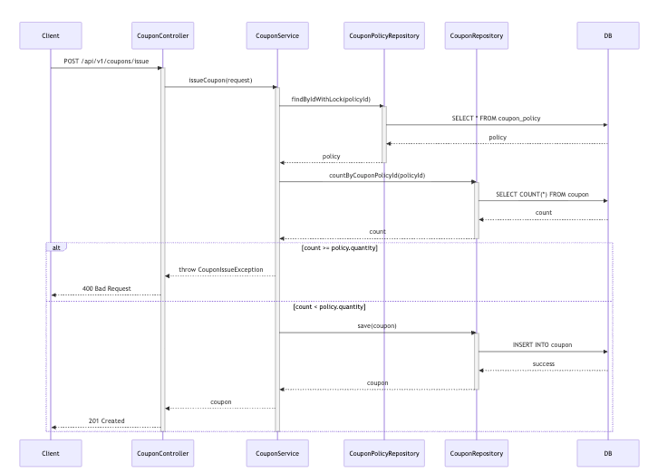
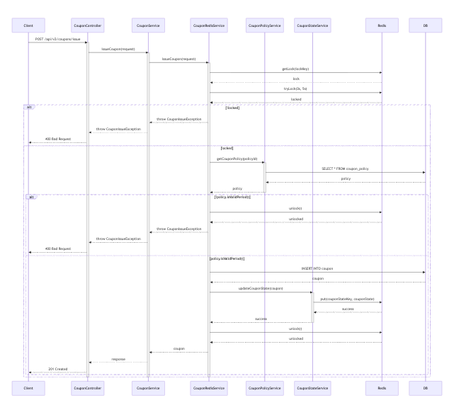
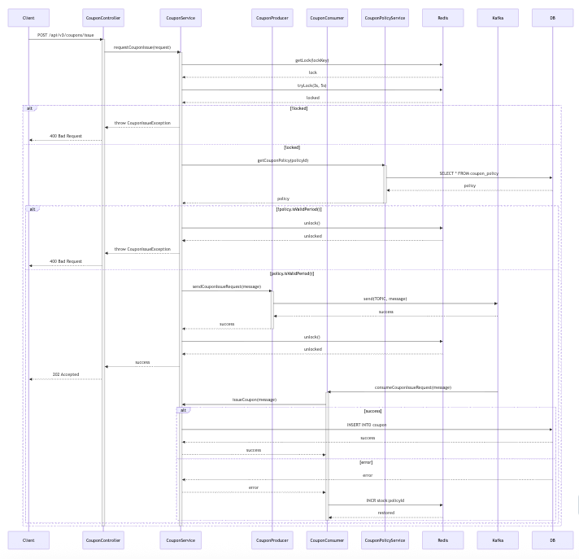

## 프로젝트 개요

### 1. 프로젝트 목표
- 대규모 할인 쿠폰 발행 시스템 구축 필요성
- 동시성 제어와 성능 최적화 요구
- 시스템 확장성과 안정성 보장
- 초당 1000건 이상의 쿠폰 발행 API 처리
- 동시성 이슈 없는 안정적인 쿠폰 발행
- 시스템 부하 분산 및 장애 대응

### 2. 시스템 아키텍처
```
[Client] → [API Gateway]
                ↓
       [Service Discovery] → [Coupon Service] → [DB]
                                    ↓
                             [Redis] [Kafka]
```
### 3. 주요 컴포넌트
1. Coupon Service
    - 쿠폰 정책 관리
    - 쿠폰 발행/사용 처리
    - 동시성 제어

2. Database
    - PostgreSQL: 쿠폰 데이터 영구 저장
    - Redis: 동시성 제어, 캐시
    - Kafka: 비동기 메시지 처리

3. API Gateway
    - 라우팅
    - 인증/인가
    - 부하 분산

### 4. 개발 단계 (v1 -> v3 순으로 개선 개발)
1. V1 - DB 기반 구현
   - 기본적인 CRUD 기능
   - JPA를 활용한 데이터 처리
   - 트랜잭션 관리

2. V2 - Redis 기반 개선
   - Redis를 활용한 동시성 제어, 분산 락 구현 (중복 처리에 대한 개선)
   - 상태 관리 최적화

3. V3 - Kafka 기반 개선
   - 비동기 쿠폰 발행
   - 이벤트 기반 아키텍처
   - 큐 기반 요청 처리


## 데이터베이스 스키마

### Users 테이블
```sql
CREATE TABLE users (
    id BIGINT PRIMARY KEY AUTO_INCREMENT,
    email VARCHAR(255) UNIQUE NOT NULL,
    password VARCHAR(255) NOT NULL,
    name VARCHAR(255) NOT NULL,
    created_at TIMESTAMP,
    updated_at TIMESTAMP
);
```

### User Login History 테이블
```sql
CREATE TABLE user_login_history (
    id BIGINT PRIMARY KEY AUTO_INCREMENT,
    user_id BIGINT,
    login_at TIMESTAMP,
    ip_address VARCHAR(45),
    FOREIGN KEY (user_id) REFERENCES users(id)
);
```

### CouponPolicy
| 필드 | 타입 | 설명 | 제약조건 |
|------|------|------|----------|
| id | Long | 정책 ID | PK, Auto Increment |
| title | String | 정책 제목 | Not Null |
| description | String | 정책 설명 | Not Null |
| totalQuantity | Integer | 총 발행 수량 | Not Null |
| startTime | LocalDateTime | 발행 시작 시간 | Not Null |
| endTime | LocalDateTime | 발행 종료 시간 | Not Null |
| discountType | DiscountType | 할인 유형 | Not Null |
| discountValue | Integer | 할인 값 | Not Null |
| minimumOrderAmount | Integer | 최소 주문 금액 | Not Null |
| maximumDiscountAmount | Integer | 최대 할인 금액 | Not Null |

### Coupon
| 필드 | 타입 | 설명 | 제약조건 |
|------|------|------|----------|
| id | Long | 쿠폰 ID | PK, Auto Increment |
| couponPolicy | CouponPolicy | 쿠폰 정책 | FK, Not Null |
| userId | Long | 사용자 ID | Not Null |
| orderId | Long | 주문 ID | Nullable |
| status | CouponStatus | 쿠폰 상태 | Not Null |
| expirationTime | LocalDateTime | 만료 시간 | Not Null |
| issuedAt | LocalDateTime | 발행 시간 | Not Null |

### Enum
1. DiscountType
```java
public enum DiscountType {
    FIXED_AMOUNT,    // 정액 할인
    PERCENTAGE       // 정률 할인
}
```

2. CouponStatus
```java
public enum CouponStatus {
    AVAILABLE,    // 사용 가능
    USED,         // 사용됨
    EXPIRED,      // 만료됨
    CANCELED      // 취소됨
}
```

### 인덱스 설정
1. CouponPolicy 테이블
   - PRIMARY KEY (id)

2. Coupon 테이블
   - PRIMARY KEY (id)
   - INDEX idx_user_id (user_id)
   - INDEX idx_order_id (order_id)
   - INDEX idx_status (status)
   - INDEX idx_issued_at (issued_at)


## 구현 버전별 비지니스 프로세스 (DB, Redis, Kafka)
### v1
- DB 트랜잭션과 동시 요청 처리에 초첨을 맞춘 개념
- 동시성 제어를 DB 레벨에서만 처리하기 때문에 적절한 락이 없다고 말할수 있음
- 트랜잭션 내 연산으로 동시성 문제를 최대한 방지함
- 동시 요청량이 많은 경우에는 DB에 과도한 부하가 걸리거나 처리량이 낮기 때문에 트래픽 증가에 취약한 구조
- 단일 서버 기반으로 작성 됐기에 확장성이 제한됨, 소규모 서비스와 같은 동시 요청이 적고 초기 단계 시스템에 유리한 구조
- 


### v2
- Redis를 활용한 분산락 구현 
- 다중 서버 환경에서도 데이터 정합을 유지하고 동시성 문제를 해결
- 구폰 발행 요청마다 Redis에서 Rock Key를 생성해 Rock 획득 여부를 기반으로 쿠폰에 대한 요청을 처리, 처리가 완료되면 Rock을 해제하여 후속 요청을 처리하도록 구현
- 분산 환경에서도 데이터 정합성을 유지할 수 있고 DB의 부하를 줄일 수 있는 장점이 있음
- Redis가 장애가 발생하면 요청 처리가 불가능 해질 수 있는 단점이 있음, 뿐만아니라 Rock Key를 잘못 관리하면 Dead Rock이 발생할 수 있음 (높은 Redis 의존성)




### v3
- Kafka를 활용한 비동기 큐 처리 구현
- Kafka 기반의 비동기 메시징 시스템을 도입하여 대규모 트래픽과 높은 TPS(Transactions Per Second)를 처리하기 위한 아키텍처
- Client의 요청은 Kafka의 큐에 저장이 되고, 해당 요청은 Consumer System에서 비동기로 처리가 된다.
- 처리 완료후 DB에 저장하거나 응답 상태로 업데이트 하는 구조
- Kafka를 통해 매우 높은 TPS를 지원할 수 있음, 뿐만 아니라 DB와 Redis의 부하를 비동기적으로 분산시켜 안정성을 높이는 장점이 있음
- 확장성이 뛰어나서 대규모 트래픽을 효과적으로 처리할 수가 있음
